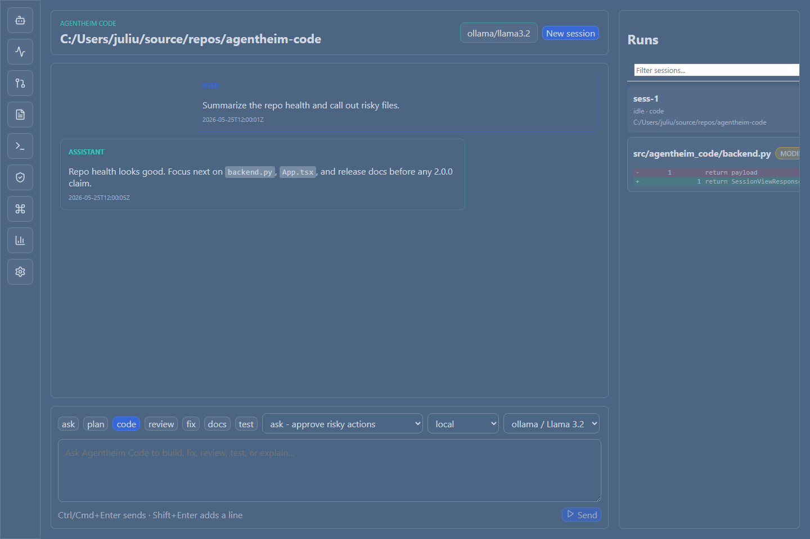

# Agentheim Code

Agentheim Code is a standalone local-first coding workbench with:

- a FastAPI backend in `src/agentheim_code`
- a React/Vite frontend in `apps/web`
- an optional Tauri desktop shell in `apps/desktop`

Current verified baseline: `2.0.0`



The product flow is simple:

1. Choose a workspace.
2. Connect a provider.
3. Start a session.
4. Send prompts and optional file context.
5. Review output, approvals, diffs, terminal results, and usage.

## Quick Start

### Browser workbench from the Python package

This is the most direct path from source or wheel install:

```powershell
pip install agentheim-code
agentheim-code app --workspace . --web
```

Open `http://127.0.0.1:8765/coder` if a browser does not open automatically.

### Packaged desktop shell

`agentheim-code app --workspace .` expects a packaged or locally built Tauri
binary. Use this mode when you have either:

- a Windows NSIS installer build
- a local desktop build from `apps/desktop`

### Developer checkout

```powershell
pip install -e ".[dev]"
npm --prefix apps/web install
npm --prefix apps/desktop install
agentheim-code app --workspace . --web
```

Build release-ready local artifacts with:

```powershell
powershell -ExecutionPolicy Bypass -File scripts/package-beta.ps1
```

## Current Product Baseline

- Release-synced `2.0.0` baseline with verified Python, web, desktop, and packaging checks
- First-run onboarding with workspace selection and Ollama auto-detection
- Providers & Models workspace with account/model/profile lifecycle management
- Session modes: `ask`, `code`, `review`
- Trust modes: `read_only`, `ask`, `workspace`
- Streaming chat with markdown and code rendering
- `@` file context search, validation, preview, and token estimate
- Incremental workspace browser with server-side paging, preview, copy path, and attach
- Approval inspector for shell, file, and tool actions
- Runs, timeline, terminal output, diff review, usage, and settings panels
- Dark, light, and high-contrast themes
- Diagnostics bundle generation and provider health reporting
- First-party OCI GenAI provider adapter; legacy vendored `aictx` bridge removed

## First Run

Fresh UI config opens onboarding automatically.

1. Pick a workspace.
2. If Ollama is running locally, the app shows the detected endpoint.
3. Or open **Providers & Models** and add a provider profile.
4. Start the first session.

Skipping onboarding only dismisses the first-run dialog. Provider setup remains
available from Settings.

## Session Modes

- `ask` keeps the interaction conversational and answer-first. It is best for
  questions, small clarifications, and lightweight guidance.
- `code` is the default implementation mode. It can inspect files, make edits,
  run commands, and summarize results like a coding partner.
- `review` stays analysis-first. It inspects code and behavior critically
  before recommending or making changes.

Legacy saved sessions or older callers may still send `plan`, `fix`, `docs`,
or `test`, but the product now normalizes those values internally to the three
supported public modes above.

## Trust Modes

- `read_only` inspects files and state without writing changes.
- `ask` pauses for risky tools or edits and asks for approval before acting.
- `workspace` allows normal workspace edits under policy without pausing for
  routine changes.

## Provider Setup

- Local auto-detection currently targets Ollama at `http://localhost:11434/v1`.
- Other local or cloud providers are configured through **Providers & Models**.
- Provider accounts can be tested before saving, secrets can be rotated later,
  and profiles can be exported or imported from the same workspace.

Useful checks:

```powershell
agentheim-code doctor
agentheim-code models
agentheim-code provider-test openai_v1 --api-key "sk-..." --endpoint "https://api.openai.com/v1" --model "gpt-4o-mini"
```

## Upgrade And Migration

Upgrade the Python package:

```powershell
pip install --upgrade agentheim-code
```

Export and import settings for migration or backup:

```powershell
agentheim-code config export --path agentheim-code-backup.json
agentheim-code config import --path agentheim-code-backup.json
```

## Docs

Start here:

- [Docs index](docs/README.md)
- [User guide](docs/USER_GUIDE.md)
- [Provider setup](docs/PROVIDERS.md)
- [CLI commands](docs/CLI_COMMANDS.md)
- [API reference](docs/API_REFERENCE.md)
- [Troubleshooting](docs/TROUBLESHOOTING.md)
- [Privacy and security](docs/PRIVACY_SECURITY.md)
- [Architecture](docs/ARCHITECTURE.md)
- [Product roadmap](PRODUCT_ROADMAP.md)

## Type Generation

The frontend can regenerate TypeScript types from the FastAPI OpenAPI schema:

```powershell
npm --prefix apps/web run types:api
```

Regenerate the stable user-doc screenshots with:

```powershell
npm --prefix apps/web run docs:screenshots
```

See `docs/adr/0002-api-type-generation.md` for details.

## What This Product Is Not

- It does not ship a general “Agentheim Full” feature set.
- It does not require the Tauri shell; browser mode is a first-class path.
- It does not expose a public network service; the backend is local-only by design.

## Development

Canonical verification commands:

```powershell
ruff check src/agentheim_code src/memory src/tools/shell tests/
ruff format --check src/agentheim_code src/memory src/tools/shell tests/
mypy src/agentheim_code src/memory src/tools/shell --follow-imports=skip
pytest --cov --cov-report=term-missing --cov-fail-under=80 -m "not integration"
npm --prefix apps/web run test -- --run
npm --prefix apps/web run build
npm --prefix apps/web run e2e
cd apps/desktop/src-tauri; cargo test
python -m build --wheel
powershell -ExecutionPolicy Bypass -File scripts/package-beta.ps1
```
